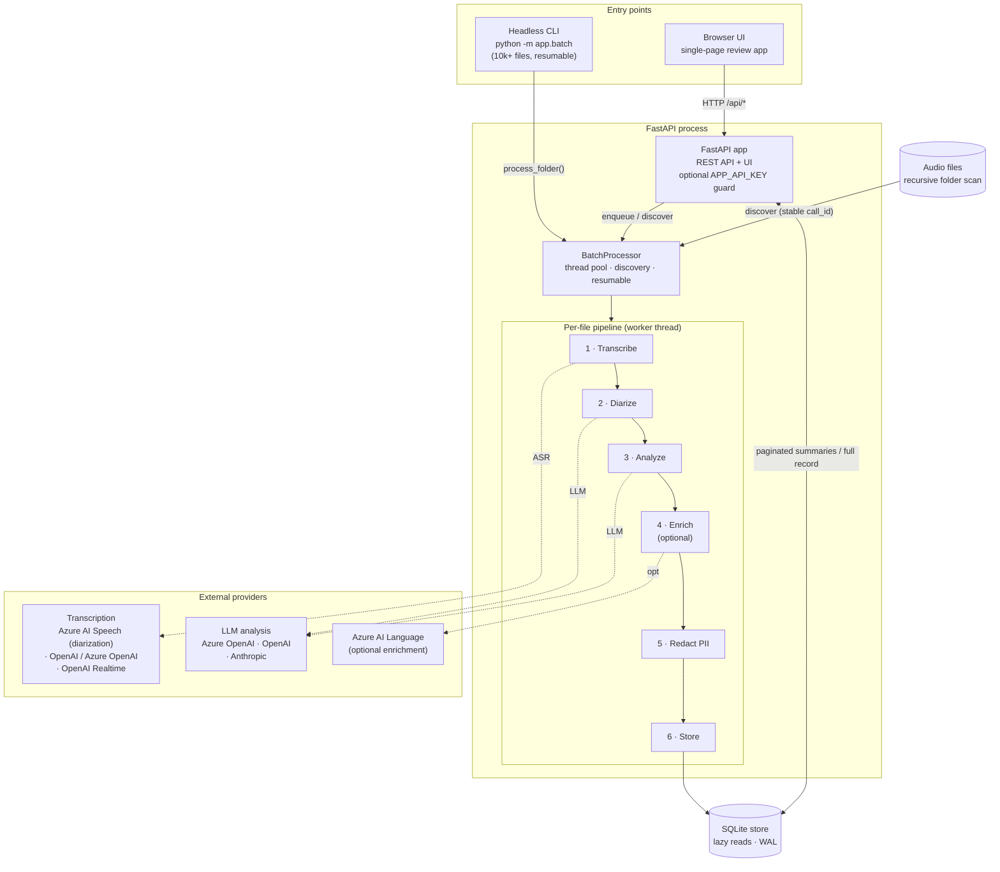

# Architecture

## Overview

A FastAPI process serves a single-page UI and a REST API, and owns a `BatchProcessor` that runs audio files through a fixed pipeline using a thread pool. State is persisted in SQLite. The same components are reused by the headless `python -m app.batch` CLI (without the web server).

```
┌────────────────────────────────────────────────────────────────────┐
│  FastAPI app (app/main.py)                                          │
│   • serves static UI + REST API   • APP_API_KEY guard middleware     │
│   • background folder scan loop (every SCAN_INTERVAL_SECONDS)        │
└───────────────┬──────────────────────────────────────┬─────────────┘
                │                                        │
                ▼                                        ▼
     BatchProcessor (processor.py)                 CallStore (storage.py)
     ThreadPoolExecutor(max_parallel_files)        SQLite, WAL, lazy reads
                │
   per-file pipeline (_process_one):
   ┌──────────────┬───────────┬────────────┬──────────────┬───────────┐
   │ transcribe   │ diarize   │ analyze    │ enrich (opt) │ redact    │
   │ audio.py     │ agent.py  │ agent.py   │ language.py  │redaction.py│
   │ ASR provider │ LLM       │ LLM (JSON) │ Azure Lang   │ numbers    │
   └──────────────┴───────────┴────────────┴──────────────┴───────────┘
                │
                ▼
   enrichment.py maps roles + sentiment onto segments → CallStore.save()
```

The same view as a rendered diagram (GitHub renders Mermaid). Solid arrows are
in-process / data flow; dashed arrows are external API calls.



## Components

| Module | Responsibility |
|---|---|
| `app/main.py` | FastAPI routes, API-key middleware, startup (config overrides, PII migration, scan loop). |
| `app/batch.py` | Headless CLI entrypoint — builds the pipeline without uvicorn. |
| `app/processor.py` | `BatchProcessor`: recursive discovery, dedup/skip logic, the thread pool, and the per-file pipeline. |
| `app/audio.py` | `TranscriptionService`: `mock`, `openai`/Azure OpenAI batch, `openai_realtime`, `azure_speech`. ffmpeg transcode, >25 MB chunking, retries. |
| `app/agent.py` | `PostCallAgent`: LLM-based diarization (assign roles) and a strict structured `PostCallAnalysis`. Provider + temperature + retry handling. |
| `app/language.py` | `AzureLanguageService`: optional PII redaction, per-utterance sentiment, summarization. Best-effort. |
| `app/enrichment.py` | Maps speaker roles + sentiment/tone onto transcript segments and applies display labels. |
| `app/redaction.py` | Local number-PII masking (`[ปกปิด]`). |
| `app/retry.py` | `retry_request` — exponential backoff on transient HTTP/network errors. |
| `app/storage.py` | `CallStore` — SQLite persistence. |
| `app/models.py` | Pydantic models: `CallRecord`, `TranscriptResult`, `TranscriptSegment`, `PostCallAnalysis`, enums. |
| `app/config.py` | `Settings` (env) + runtime-override application. |
| `app/static/index.html` | The entire browser UI (HTML/CSS/JS, no build step). |

## The pipeline

For each file, `BatchProcessor._process_one` advances a `stage` that the UI shows live:

1. **transcribing** — `TranscriptionService.transcribe()` returns `TranscriptResult` (segments with start/end/speaker/text). Files > 25 MB are chunked into 10-min segments and merged.
2. **diarizing** — `PostCallAgent.diarize_transcript()` asks the LLM to label every segment `customer` or `call_center_staff` (reading the whole transcript, not assuming turn-taking). `azure_speech`/diarize models already provide speaker tags; this normalizes them.
3. **analyzing** — `PostCallAgent.analyze()` uses structured output to produce `PostCallAnalysis` (summary, session topic, agent/customer profiles, sentiments, tone flags, emotion journeys, critical flags, credit-card products, risks, next actions, quality notes).
4. **enriching** (optional) — `AzureLanguageService.enrich()` adds Azure PII redaction / sentiment / summarization if configured.
5. **redact** — `redact_transcript()` masks numeric PII in the stored transcript.
6. `enrichment.enrich_transcript_with_analysis()` attaches roles + per-segment sentiment, then `CallStore.save()`.

A failure at any stage sets `status=failed` with the error message; the file can be retried (re-run is idempotent).

### Speaker roles

`agent.py` classifies speakers using behavioral evidence and a tie-breaker. Because diarization may surface a person's name (e.g. `นาลินี`) rather than "Agent", the frontend builds a `speaker → role` map from the analysis `speaker_classifications` (matching both the label and `display_name`) so the timeline lanes and chat bubbles place named speakers correctly, falling back to keyword matching.

## Concurrency

- `BatchProcessor` runs up to `MAX_PARALLEL_FILES` files at once in a `ThreadPoolExecutor`. An `_active` set + lock prevents enqueuing the same file twice.
- `CallStore` uses one SQLite connection (`check_same_thread=False`) guarded by a lock, in WAL mode. DB operations are sub-millisecond next to ASR/LLM latency, so serializing them is not a bottleneck.
- `Settings` is a process-wide singleton mutated in place by `PATCH /api/config`; scalar writes are atomic under the GIL (a concurrent multi-field patch may be observed half-applied by an in-flight job — acceptable for these tuning knobs).

## Storage

`CallStore` (SQLite, `DATA_DIR/calls.db`):
- One `calls` table with denormalized scalar columns (`id`, `status`, `updated_at`, `session_topic`, …) plus the full record JSON in a `data` column. Indexes on `status`, `updated_at`, `file_path`.
- `get(id)` reads one row lazily — nothing is held in memory, so 10k+ records don't bloat RAM or slow startup.
- `list_summaries(limit, offset, status)` powers the paginated UI without parsing record bodies; `count()` for totals; `iter_records()` streams full records (used by the startup PII migration).
- On first run, auto-imports any legacy `DATA_DIR/calls/*.json` files (idempotent upsert).

Identity: a `call_id` is a SHA-1 of `resolved_path:size:mtime`, so re-discovering an unchanged file maps to the same record (resumable), while an edited file becomes a new record.

## Resilience & scale

- **Retries** — `azure_speech` HTTP calls use `retry_request` (backoff on 429/5xx/timeouts, honoring `Retry-After`); LLM clients use `max_retries=4`.
- **Resumable** — completed files are skipped unless `force`/`reanalyze`. Interrupted runs continue on restart.
- **Headless scale** — `python -m app.batch` reuses everything for unattended bulk runs. See [BATCH.md](BATCH.md).

## Request flow (UI)

1. `GET /api/calls` → paginated summaries fill the sidebar (with a "Load more" button).
2. Selecting a session → `GET /api/calls/{id}` fetches the full record (cached client-side) and renders the detail view.
3. A 5s poll refreshes the loaded summaries and re-fetches the open session's detail while it's processing — playback state is tracked per session so switching calls never mixes positions.
